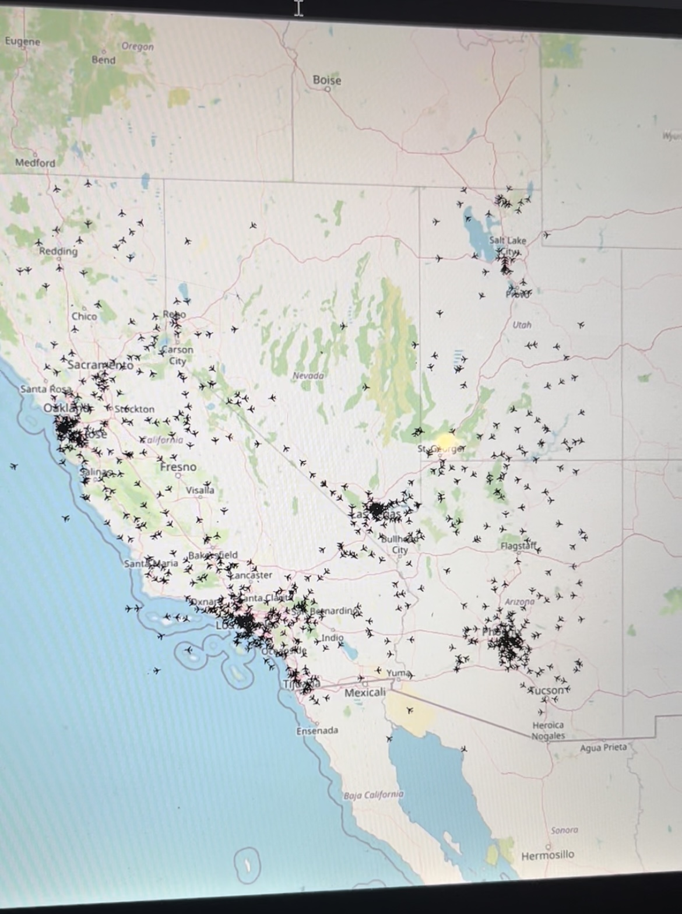

# Airplane Timelapse Map Application

This is a frontend web application that displays a timelapse of airplanes' movements over a certain period of time on an interactive map using OpenLayers. The application leverages real-time data to provide users with an engaging and informative experience. This README will guide you through the setup, features, and usage of the application.



## Table of Contents

- [Getting Started](#getting-started)
  - [Prerequisites](#prerequisites)
- [Usage](#usage)
- [Features](#features)
- [Technologies Used](#technologies-used)
- [Contributing](#contributing)
- [License](#license)

## Getting Started

### Prerequisites

Before you can use this application, you need a modern web browser with JavaScript enabled. No additional dependencies or build tools are required.

## Usage

To run the application, follow these steps:

1. Clone this repository to your local machine using Git:

   ```bash
   git clone https://github.com/Alexander-Aghili/AirTrafficHistoryClient.git
   ```

2. Open the `index.html` file in your web browser.

3. The application will load, and you can start exploring the timelapse of airplanes' movements. You will need to have the backend enabled, connected, and the parameters are setup in the code for now. That may change in the future.

## Features

- **Interactive Map:** Display an interactive map using OpenLayers with zoom and pan capabilities.
- **Airplane Timelapse:** Animate the movement of airplanes over a specified period of time.
- **Real-time Data:** Utilize real-time data sources (e.g., flight data APIs) to fetch the current location and movement of airplanes.
- **Customization:** Allow users to customize the timelapse settings, such as speed, date, and area of interest. (In Code)
- **Information Overlay:** Provides flight number of airplane.
- **Responsive Design:** Ensure the application is responsive and works well on different screen sizes and devices.

## Technologies Used

- [OpenLayers](https://openlayers.org/): An open-source JavaScript library for displaying maps on the web.
- [Flight Data API]: Integrate a real-time flight data API for fetching airplane movement information.

## Contributing

We welcome contributions to improve this project. If you'd like to contribute, please fork the repository, make your changes, and create a pull request.

Please ensure your code follows best practices and is well-documented.

## License

This project is licensed under the Apache License - see the [LICENSE](LICENSE) file for details.
